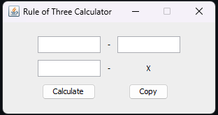

# Java Rule of Three Calculator

Java Rule of Three Calculator is a Java program designed to calculate the proportional value based on three given values. It provides a graphical user interface built using Java Swing.

## Features

- **Calculate Proportional Value:** Calculate the proportional value using the rule of three based on three given input values.
  
- **Copy Result to Clipboard:** Copy the calculated result to the system clipboard with a single click.

## How to Use

1. **Input Values:** Enter three values in the provided text fields.
  
2. **Calculate:** Click the "Calculate" button to compute the proportional value based on the input values.

3. **Copy Result:** Click the "Copy" button to copy the calculated result to the system clipboard.

## Requirements

- Java Development Kit (JDK)
- Java Swing library

## Usage

1. Compile the Java code using the following command:

    ```bash
    javac Main.java
    ```

2. Run the compiled program:

    ```bash
    java Main
    ```

## Screenshot



## License

This project is licensed under the [MIT License](LICENSE).
